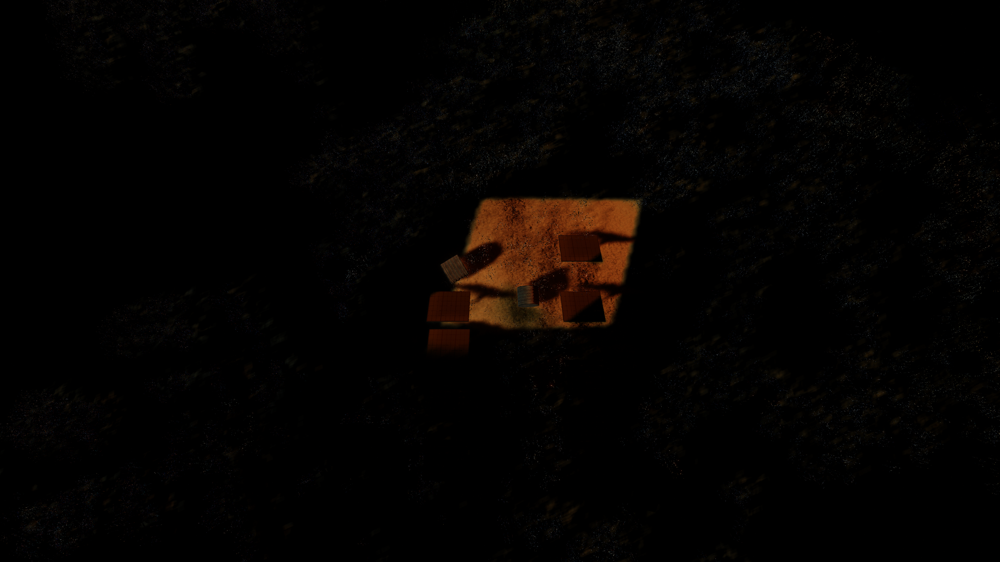

Simple pipeline for automatically labelling shadows in AirSim.
The project files can be downloaded from: https://drive.google.com/file/d/1KEpmanbHe8hTl32gHlWhTfDQxzi6PtVo/view?usp=sharing 

## dataset_generation_viewpoints.py

Saving sets of pictures taken from the bottom camera at predefined viewpoints, code is run once with shadows and one wihout, as there is no random factor (waypoints are predefined and fixed), the difference between 
respective frames in both folders corresponds to the shadowed area, enabling the creation of automatic
RGB-Shadow labelled pairs:). 

The reason why viewpoints are used and not recording from the flight, is the fact
that two flights are not usually identical due to floating point errors in the physics model governing the flight,
and small time-shifts between respective relative trigger times. Creating viewpoint sets is a good way to ensure 
that the frames with and without shadows show precisely the same scene. 

This is equivalent to capturing the frames from the flight, while significantly reducing the computational load,
which is high already due to rendering of this realistic environment (environment has quite many meshes, grass/plants are
notoriously computationally expensive to render properly with their shadows). 

Finally, AirSim by default uses positions defined with respect to the player start position (position from which the drone starts). As long as the starting point of the drone is not changed, it would be a good, consistent way to label the frames
with position for cross-dataset compatibility. However, as changing the starting position is quite often, pictures
are embedded with the location in the \textbf{world frame}, which is consistent even when the starting position does change.
To do that, AirSim's functionality of extracting position and pose of static meshes in the world frame is used.

## Lighting and shadow generation
To generate light, directional light source is used. To simulate shadows effectively a opaque or semi translucent static mesh can be used, it effectively models every possible type of shadows.

To summarize the logic, if we want to label shadows generated by the clouds, we run the simulation with clouds, then we run it without them, comparing the respective frames shows where are the shadows, and the magnitude of greyscale change shows the intensity of the shadow. 

Any object can be used to occlude the light, simplest approach was used, as this is a proof-of-concept approach.

## Dynamic shadows
To make a shadow dynamic, a simple blueprint can be added to move the light-occluding surface (e.g. cloud, plane, etc.).

## Visual comparison

The following images demonstrate the different types of data captured and processed:

### Visualization

| No shadows | With shadows |
|------------|-------------|
|  |  |

| Shadow | Shadow labelled on the original frame |
|------------------|---------------------|
|  |  |

